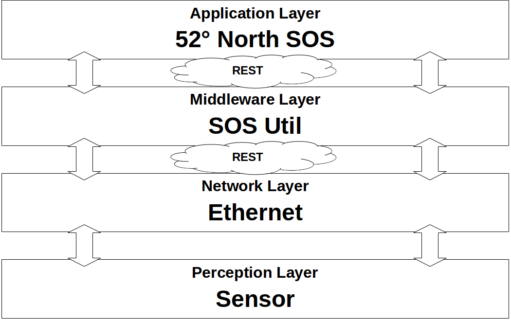
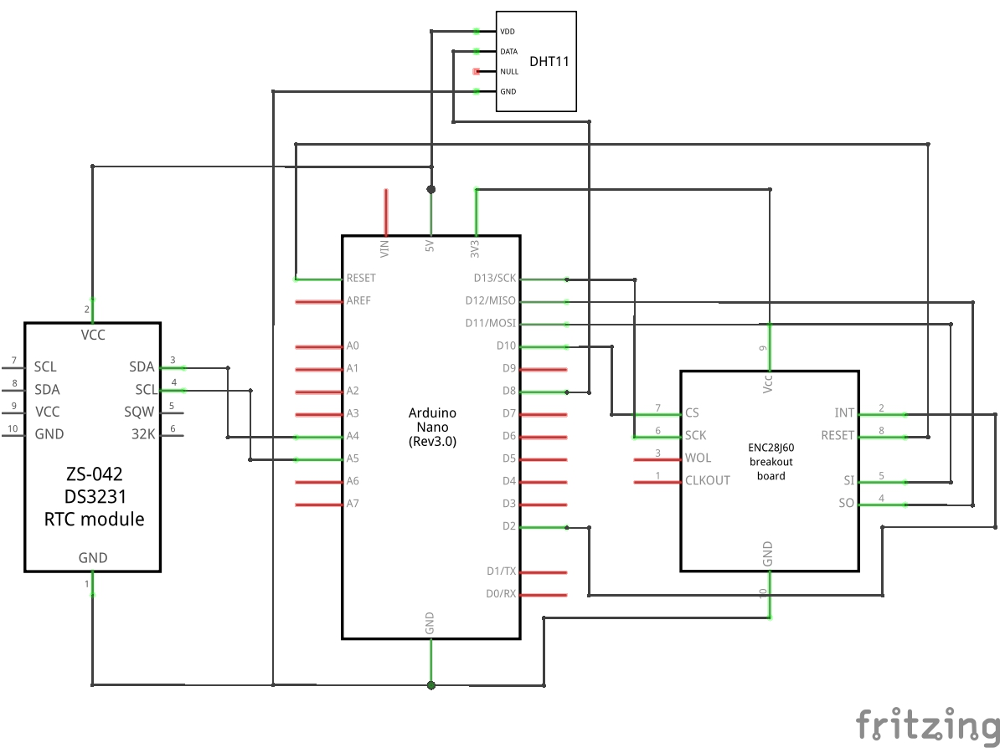
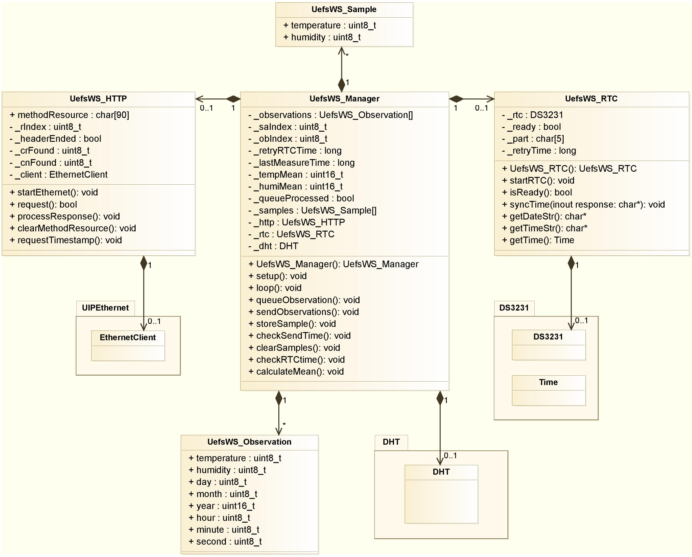
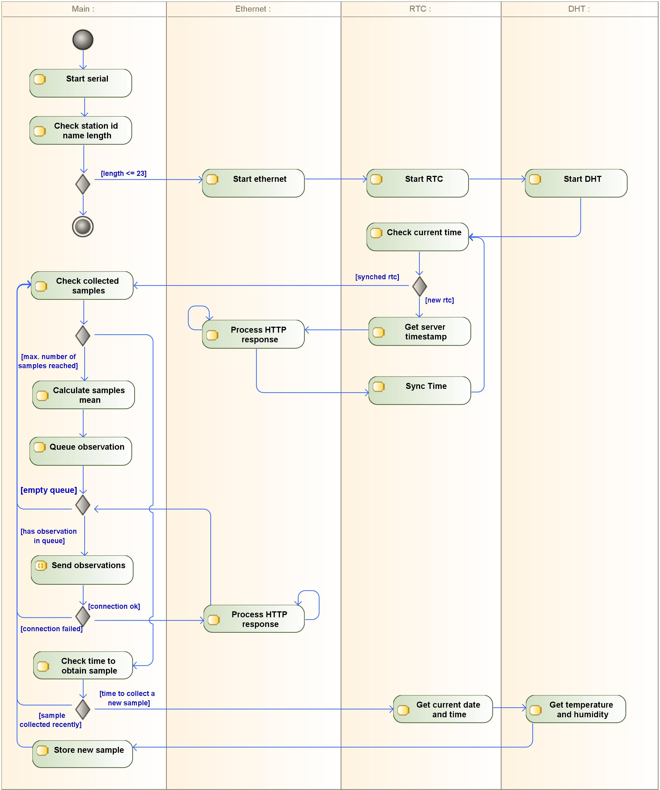

# Uefs Weather Station - UefsWS
This is an Arduino project that enables a SWE ready  weather station to measure temperature and humidity that sends observations to a [52° North SOS](https://github.com/52north/SOS) using the middleware service [52° North SOS Util](https://github.com/natanaelsimoes/52n-sos-util).

## Configuring

All parameters you need to change are in [UefsWS_Consts.h](UefsWS_Consts.h).

## Architecture

The proposed acquisition system was designed to automatically collect temperature and humidity data and transfer it through the Internet to a instance of 52° North SOS server. Main electronic component is a Arduino Nano that manages sensors and communication. Its architecture based on the framework of IoT contains four layers: perception layer, network layer, middleware layer, and application layer.

### Perception Layer

This layer consists in sensors used to collect temperature and humidity data, programmed to store samples over time and send its mean every hour.

### Network Layer

The network layer represents functions of data transmission. Current system is built over an Ethernet wired connection in a Local Area Network (LAN) using existing infrastructure of near buildings to communicate with server through the web. To transfer data, the sensor system and a middleware exchanges HyperText Transfer Protocol (HTTP) requests and responses via RESTful API.

### Middleware Layer

This layer is mediator between the acquisition system and the SOS. Microcontrollers with low memory capacity as Arduino Nano (uses an Atmel ATmega328p with 2KB SRAM) cannot handle large XML or JSON files as required by SWE SOS specifications. Middleware layer receives raw temperature and humidity data, process it into a SOS valid document, then send generated request to SOS instance and forward the response back to the station.

### Application Layer

The application layer is a running instance of 52° North SOS that provides functions to store, query and manage sensor collected data.

## Electronic Composition

* Arduino Nano with microcontroller Atmel ATmega328p: controls entire application executing a object-oriented program written in C++;
* Real time clock DS3231 module: every observation is queued with date and time information gathered from this RTC, its data is synchronized with SOS Util server;
* Ethernet ENC28J60 module: used for communication;
* Sensor DHT11: captures temperature and humidity; 
* Energy supplier: less than 500mA will not boot up Ethernet module.

## Class structure

## Activity

